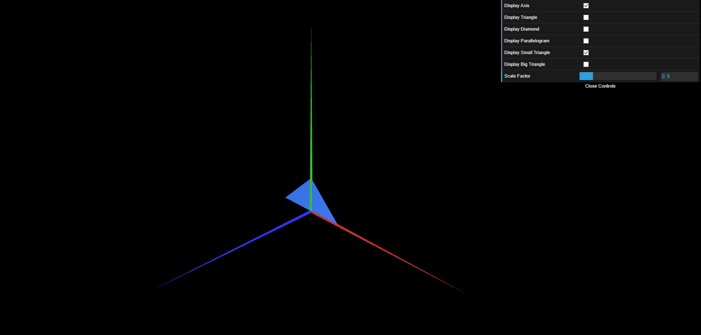
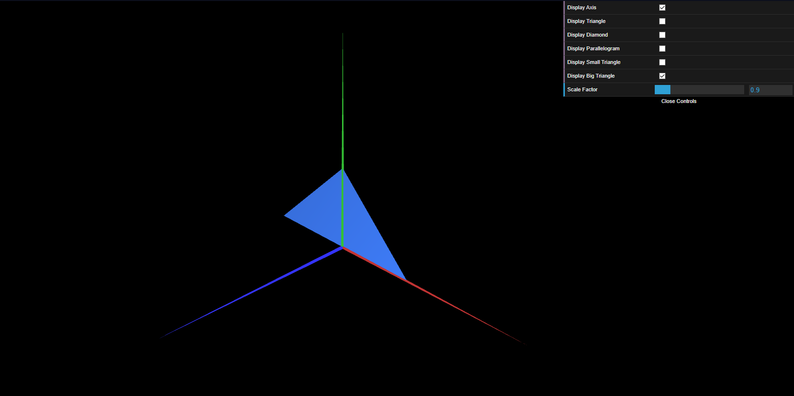

# CG 2023/2024

## Group T12G09

## TP 1 Notes

- In exercise 1 we were able to understand the roles of each class and how they are related with each other. We figured that the scene is where all objects coexist, and the class MyScene is where all the objects are instanciated and configured as well as the "environment" where they appear. The class MyInterface allows for the creation of a gui that enables the user to controll objects' visibility and scale and the remaining classes define each object itself. We were also able to further understand how indices work and how we can use them to create the desired shapes, mainly while creating the paralellogram.
- In exercise 1, in order to make the paralellogram double-sided we repeated the indices in reverse order.
- Thanks to the notions we got from exercise 1, exercise 2 was fairly easy. We created the small triangle and then the big triangle by doubling small triangle's coordinates of each vertex. We also took the opportunity to create visibility checkboxes for the two new objects.

Figure 1: Small Triangle

Figure 2: Big Triangle

