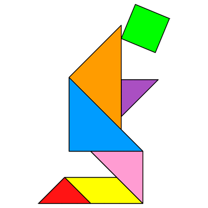
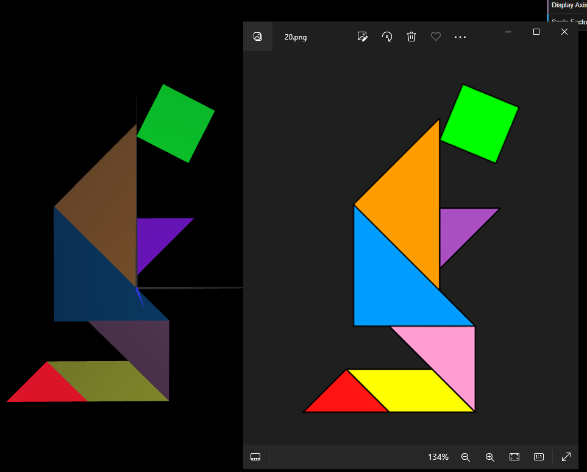
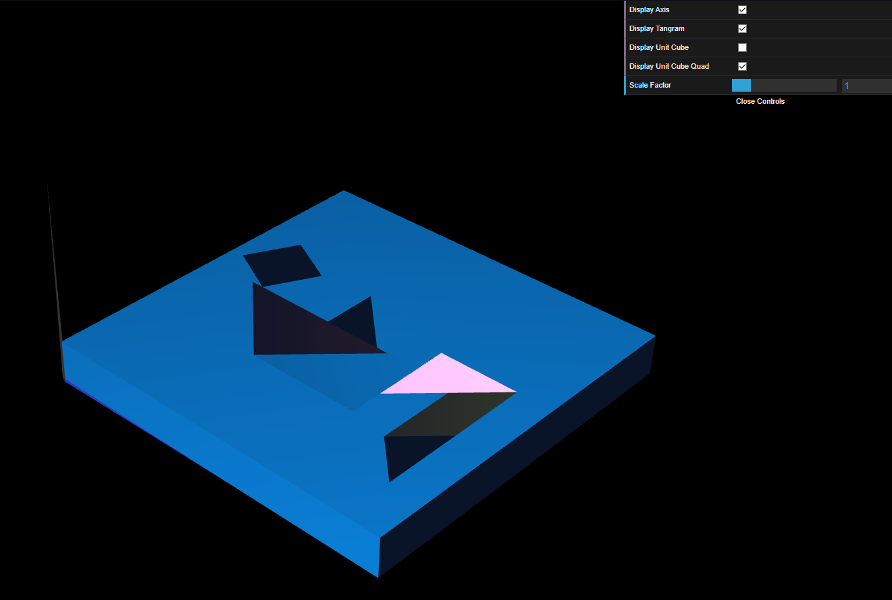

# CG 2023/2024

## Group T12G09

## TP 2 Notes

- In exercise 1 we used the shapes we crafted in the previous practical assignment and assembled the tangram figure we were assigned, **tangram 20**

Figure 1: Tangram 20

- Figuring out how to execute the geometrical transformations themselves was a fairly simple task and once we figured how to do it properly it was very easy to assemble the figure. The harder task was to understand the role of the transformation matrix and how then the multiplication matrix worked, but it became more clear when we understood the stack and how the matrix is pushed and popped every time we apply transformations to an object.

Figure 2: Our Built Tangram 20

- In exercise 2 the building of the cube was intuitive based on what we did before. We ought to assemble all the vertexes and then order the triagle indices and the cube was formed.

Figure 3: UnitCube and Tangram 20

- In a similar fashion we also didn't have any trouble in exercise 3. We created a simple square, placed it in the axis origin as requested, displayed it 6 times for each of the 6 cube faces and then applied geometrical transformations (just like we had to build the tangram, but on the MyUnitCubeQuad class instead of MyScene) in order to place each face correctly forming a cohesive block, the unitCubeQuad.

Figure 4: UnitCubeQuad and Tangram 20

As a side note, we also took the opportunity to once again create the display buttons for each object.

