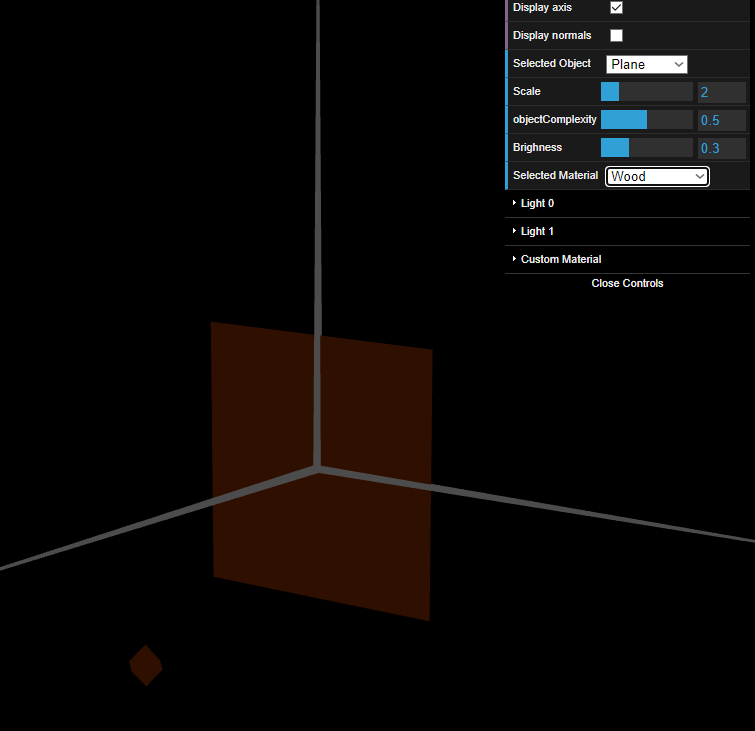
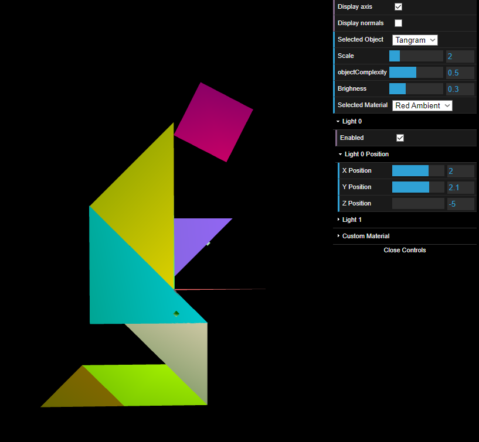
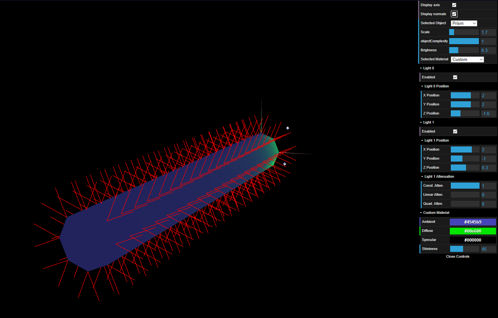
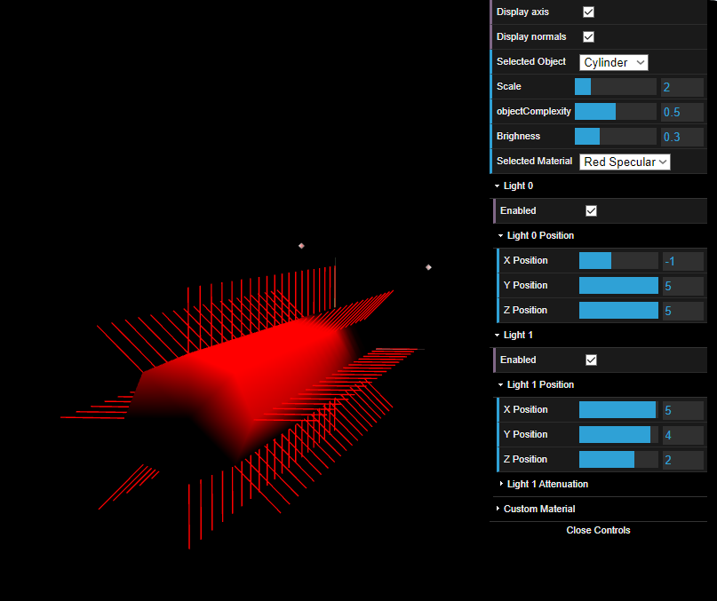

# CG 2023/2024

## Group T12G09

## TP 3 Notes

- In Exercise 1, using the figures created in the TP1 and TP2 sessions, we created all the necessary normals to simulate more realistic lighning effects. In addition we created a new material with a color similar to wood, featuring a low specular component.

Figure 1: Wood Plane

- Also in Exercise 1, we applied various materials with a high specular component to the figures present in the tangram.

Figure 2:Tangram Materials

- In Exercise 2, we built a prism with a number of sides and structural complexity. The most complex part was to create an algorithm capable of accurately determining vertices and their associated normalized normals.

Figure 3: Prism

- In Exercise 3, we positioned normals perpendicularly to the prism's surface. This reduced the number of vertices and normals to be calculated. As expected, the transitions of lighting at the edges were smoothed out and gave a curved aspect to the surface of the previous prism.

Figure 4: Cylinder

As a side note, we also took the opportunity to once again create the display buttons for each object.

