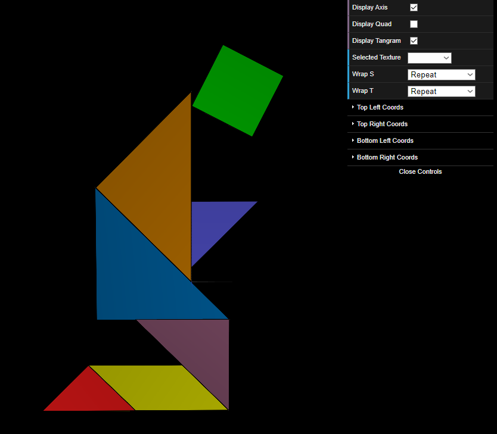
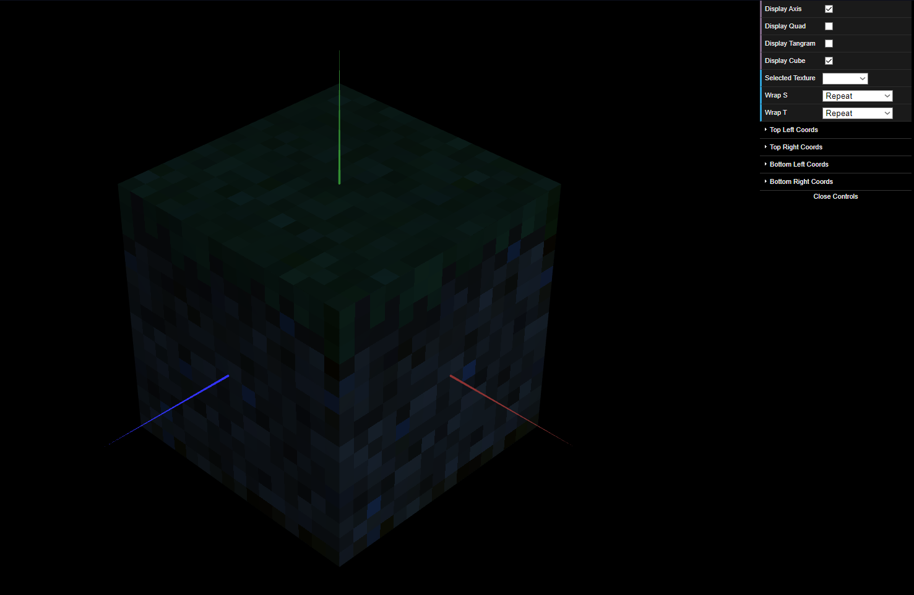

# CG 2023/2024

## Group T12G09

## TP 4 Notes

We found this task easier to accomplish than the previous practical assignment.

For the first exercise, we mapped the coordinates of each of the polygons on the image, in order to be able to use each of them separatedly to match each of our own.
After some analysis we quickly understood the texture coordinates and were able to isolate each of the shapes, resulting in the image displayed bellow:

The second exercise was faily straight-forward, since we simply followed the instructions provided. After uncommenting the code line indicated, we then replicated it in the MyUnitCubeQuad class, for each of the faces. This way, we were able to make the textures more defined, as it can be seen bellow:

