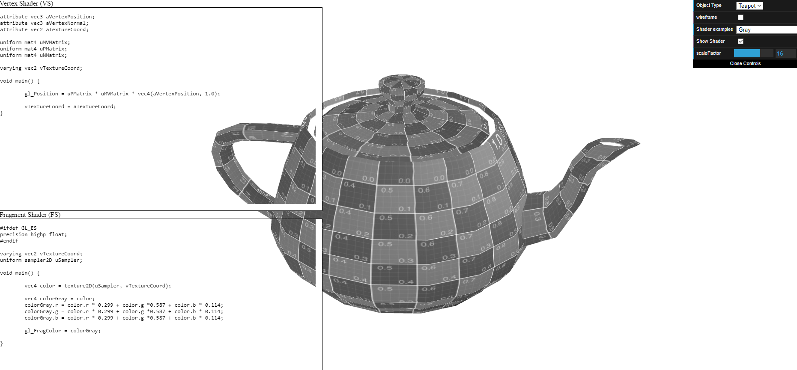

# CG 2023/2024

## Group T12G09

## TP 5 Notes

- In the first part of exercise 1, we created a new Vertex Shader and a Fragment shader to paint the bottom of the teapot blue and the top yellow.

Figure 1: Yellow and Blue Teapot

- In the second part of exercise 1, we created a movement on the XX axis following a sinusoidal wave. Then, the teapot was painted with a gray color based on sepia:

Figure 2: Gray Teaput 

- In exercise 2, we applied the water texture with shaders on the plane. The texture coordinates were animated over time, and the vertices according to the texture color components, in order to create a water effect movement.

Figure 3: Water Effect
